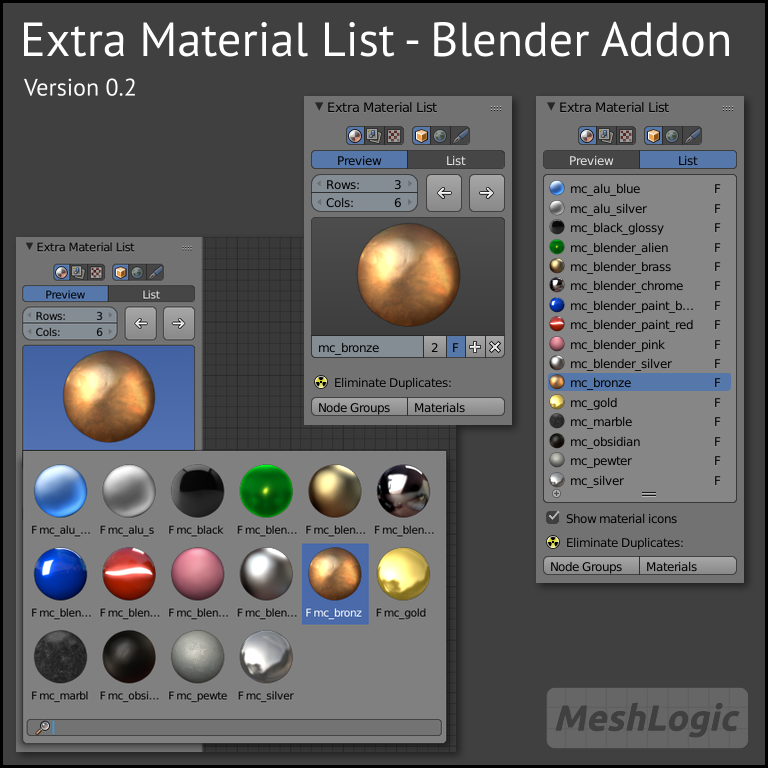

# Extra Material List
A Blender addon to list object/world materials in a more comfortable way in the node editor.

- Display materials as preview or plain list
- Display object and world materials
- Option to eliminate duplicates for node groups and materials

## Changelog

### 0.2 (2017-08-11)
- Added a feature to eliminate duplicates for node groups and materials

### 0.1 (2017-05-30)
- Initial release for Blender 2.78
